Welcome to the playful world of VEX 123! This is where your child can take their first steps into coding and robotics, all while having a ton of fun. As a parent, you might wonder how you can help your little one get the most out of the VEX 123 Robot. Don't worry; this guide is here to walk you through just that. It offers a comprehensive walkthrough from setting up your VEX 123 Robot and programming with its touch buttons, to advancing with VEX Coder Cards, and exploring the endless possibilities with VEXcode 123, the online platform that provides even more flexibility and control for young coders. Accompanied by a series of progressively challenging exercises, this guide introduces key programming concepts like conditional logic and loops, engaging and in-depth learning experience.

## Table of Contents

[Introduction to VEX 123](#introduction-to-vex-123)

[Getting Started with Your VEX 123 Robot](#getting-started-with-your-vex-123-robot)

[Programming Basics with Touch Buttons](#programming-basics-with-touch-buttons)

- [Exercise 1: First steps](#exercise-1-first-steps)
- [Exercise 2: Sequence of moves](#exercise-2-sequence-of-moves)
- [Exercise 3: Predicting the movement](#exercise-3-predicting-the-movement)
- [Exercise 4: Avoiding obstacles](#exercise-4-avoiding-obstacles)

[Coding with the VEX 123 Coder](#coding-with-the-vex-123-coder)

- [Exercise 5: Basic movements with cards](#exercise-5-basic-movements-with-cards)
- [Exercise 6: Combining different cards](#exercise-6-combining-different-cards)
- [Exercise 7: Getting emotional about obstacles](#exercise-7-getting-emotional-about-obstacles)

[Introducing Conditional Logic: If Statements](#introducing-conditional-logic-if-statements)

- [Exercise 8: If this then that](#exercise-8-if-this-then-that)
- [Exercise 9: Color-coded decisions](#exercise-9-color-coded-decisions)

[Continuing Conditional Logic: Else Statement](#continuing-conditional-logic-else-statement)

- [Exercise 10: To ring or not to ring](#exercise-10-to-ring-or-not-to-ring)

[Exploring Loops](#exploring-loops)

- [Exercise 11: Non-stop merry-go-round](#exercise-11-non-stop-merry-go-round)
- [Exercise 12: The endless bump-a-thon](#exercise-12-the-endless-bump-a-thon)

[Exiting Loops Programmatically](#exiting-loops-programmatically)

- [Exercise 13: Stop right there](#exercise-13-stop-right-there)

[Combining What We've Learned](#combining-what-weve-learned)

- [Exercise 14: Predicting code](#exercise-14-predicting-code)

[Diving into VEXcode 123](#diving-into-vexcode-123)

- [Connecting your robot with bluetooth](#connecting-your-robot-with-bluetooth)
- [Navigating the VEXcode 123 interface](#navigating-the-vexcode-123-interface)

[Nested if](#nested-if)

[Introducing variables](#introducing-variables)

[Introducing the while loop](#introducing-the-while-loop)

- [Combining loops with if statements](#combining-loops-with-if-statements)

[Final Thoughts](#final-thoughts)

## Introduction to VEX 123

Vex 123 is an interactive robotics kit designed to introduce the youngest learners, starting as early as 4 years old, to the foundational concepts of coding and robotics. As the most elementary offering in the Vex Robotics lineup, it's tailor-made for early childhood education, emphasizing hands-on play and exploration to spark interest in STEM (Science, Technology, Engineering, and Mathematics) fields from a preschool age. Plus, it offers a screen-free learning experience, making it an ideal way to engage with technology hands-on.

## Getting Started with Your VEX 123 Robot

In this guide, I will assume that you have the [VEX 123 Kit](https://www.vexrobotics.com/123-kits.html), which includes the 123 Robot, the Coder Bundle, as well as the 123 field.

*The VEX 123 complete kit.*

First, ensure your Vex 123 Robot is fully charged:

- Connect a USB-C cable to the robot's charging port and the other end to a power source.
- A flashing red light on the robot's Start button indicates it's charging.
- Once the flashing turns green, the robot is fully charged.

*Charging the robot.*

Once fully charged, you can turn on the robot by pushing its wheels along a flat surface.

*Waking the robot up.*

## Programming Basics with Touch Buttons

Programming with the VEX 123 Robot's touch buttons is a straightforward way to teach your child the basics of coding. Use the buttons on the top of the robot to input a sequence of commands. Pressing the central "VEX" button will set the robot in motion, executing the commands in the order they were entered. Each button on the robot triggers a specific action:

- Move Forward: Directs the robot to move forward by one tile.
- Left/Right: Rotates the robot 90 degrees to the left/right.
- Sound: Triggers the robot to play a sound.
- VEX (Start): Executes the programmed sequence of commands. Also used to turn off the robot by holding this button for 3 seconds.

### Exercise 1: First steps

Let's start by just playing around.

1. Place the robot on the 123 field, on the middle of a tile, pointing at one of the four directions, as illustrated below.
2. Have your child press the "move forward" button, followed by the central VEX button to start.
3. Once they observe the robot advancing by one tile, return the robot to its starting point.
4. Press the left button, and run the program by pressing on the VEX button.
5. Observe how the robot still remembers the initial "move forward" command and simply adds the new "turn left" command to its sequence.
6. Continue to introduce one command at a time, pressing the center VEX button each time to run the program and observe the outcome.

*The robot should point in one of these 4 directions.*

It's important for your child to grasp that the robot retains previously entered commands and combines any new commands with those already in memory. Encourage them to explore this feature.

To clear the robot's memory of the existing command sequence, simply have your child pick up the robot and give it a shake. This action 'resets' the robot, erasing all previous commands as if shaking them out of its "brain". Give it a try and see how the robot responds as if it's learning for the first time!

*Making the robot forget the previous commands.*

### Exercise 2: Sequence of moves

Now that you're familiar with the robot's basic movements, let's focus on a 3x3 tile grid, which is one quarter of the entire VEX 123 field. Place the robot on the bottom left tile to start.

*Robot placed at the bottom left tile.*

The goal is to program the robot to reach the top right tile, exploring different sequences of commands to navigate across the grid.

1. Have your child plan a path and then input the sequence using the forward and turn buttons to navigate the robot across the grid.
2. If you child succeeds in finding a path, challenge them to find other paths by experimenting with combinations of moves and turns.
3. After each try, remember to shake the robot to clear its memory and prepare it for a new set of commands.

*Robot moving from one side of the field to the other with one possible set of commands that instruct it to get there.*

### Exercise 3: Predicting the movement

This exercise shifts focus to prediction and critical thinking. Using the VEX 123 field, your child will now predict the robot's final position after a series of commands.

1. Position the robot at the bottom left tile, ensuring your child is watching.
2. Clearly press a sequence of commands in view of your child, such as "forward, forward, turn left, forward". Consider announcing the commands out loud as you press them.
3. Before having the robot play out the commands, ask your child to predict where on the field the robot will end up after executing these commands. Have them point to the tile.
4. Press the VEX button to set the robot in motion and observe whether the robot's final position matches your child's prediction.
5. If they get it right, increase the complexity and/or the number of commands given to the robot.
6. For an occasional added twist, without resetting the robot's memory, add an additional command like "forward" to the existing sequence. Now, your child must also pay attention to whether you shake the robot or not!

As a simple example, here are some ideas of sequences (note that "turn left" and "turn right" are abbreviated with just "left" and "right"):

- forward, forward, forward
- shake
- forward, forward, left, forward
- shake
- left, left, right
- shake
- forward, left, right, forward
- forward
- shake
- forward, forward, left, left, forward, right, forward

*A child predicting where the robot will terminate its sequence.*

Through this exercise, your child will enhance their ability to predict outcomes based on a sequence of actions, a fundamental skill in programming logic and computational thinking.

### Exercise 4: Avoiding obstacles

Start by placing a single obstacle between the robot's starting point and its destination on the field, as shown in the first illustration below. Encourage your child to program the robot to navigate from the start to the finish, carefully avoiding the obstacle. The obstacle can be anything that fits within the space of one or more tiles, such as a smartphone, sunglasses, or an empty cup.

*Programming the robot to navigate around a single obstacle on the field.*

To increase the challenge, consider adding multiple obstacles to the field. This will require more complex programming and strategic planning to successfully guide the robot to its destination. Use a variety of objects as obstacles to make the exercise more engaging and dynamic.

*Introducing multiple obstacles for enhanced navigation and problem-solving.*

## Coding with the VEX 123 Coder

The VEX 123 Coder and its Coder Cards transition from the robot's touch buttons to a visually intuitive format for programming. The cards remove the need to remember button sequences by clearly showing each command, making it simpler to control the robot and create complex sequences. With the Coder, children can move beyond basic commands to explore more advanced programming concepts such as control flow.

Once batteries are inserted in the VEX Coder, you can turn it on by pressing the Start button. To connect the Coder to the robot, press and hold the (green) Start and (red) Stop buttons on the Coder and the Left and Right buttons on the Robot for 5 seconds until the yellow lights appear, signaling the start of the pairing process. You only need to pair them once, and they will stay connected for subsequent uses.

For more details about the Coder, visit [Using the VEX Coder](https://kb.vex.com/hc/en-us/articles/360055037612-Using-the-VEX-Coder).

### Exercise 5: Basic movements with cards

In this exercise, you'll use the **blue movement cards** to direct the robot across the field. Start by selecting a series of movement cards that will guide the robot in a simple path, such as a straight line using the "drive 1" cards.

> Please note that the first card must always be the red "when start 123" card.

*Sequence illustrating a straight-line path using movement cards.*

Next, try adding some rotations: "turn left", "turn right", "turn around" and "turn random". Allow them at least a few minutes to play around the with current set of cards, and to try out longer and longer sequences.

And finally, try out the "drive until crash", "drive until object", and "drive until line" cards. See what they do. Programming is all about experimenting!

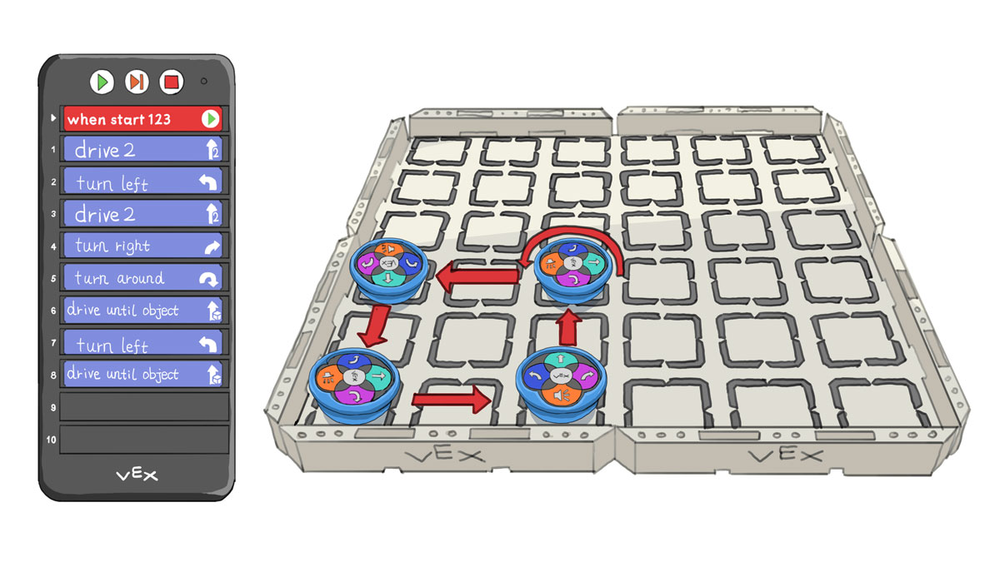
*Sequence example for returning the robot to the bottom left starting point.*

This is also a great time to practice stepping through your code. Instead of launching the program with the green Start button, use the orange Step button to advance through the code one command at a time. Each press illuminates the next command with an orangish-yellow light, visually cueing the action to be executed. This is particularly useful if your child is puzzled by the robot's behavior, as it breaks down the actions into manageable steps.

For an in depth guide about stepping, visit [Stepping Through a Project with the Coder](https://kb.vex.com/hc/en-us/articles/360056924531-Stepping-Through-a-Project-with-the-Coder).

### Exercise 6: Combining different cards

Now, let's add more variety to your robot's movements by incorporating other types of cards into your sequences. This introduces the concept of combining movements with actions (the green cards), sounds and looks (the two shades of purple), and execution pauses (the grey cards), adding a layer of complexity and fun to your coding projects.

To explore the full range of Coder cards, excluding the orange and red cards for now, visit the [VEX Coder Card Reference Guide](https://kb.vex.com/hc/en-us/articles/360055264691-VEX-Coder-Card-Reference-Guide).

Have your child play around with all these cards in whatever order they wish. Make sure they write some programs using all types of cards. This could take them anywhere from a few minutes to hours of fun.

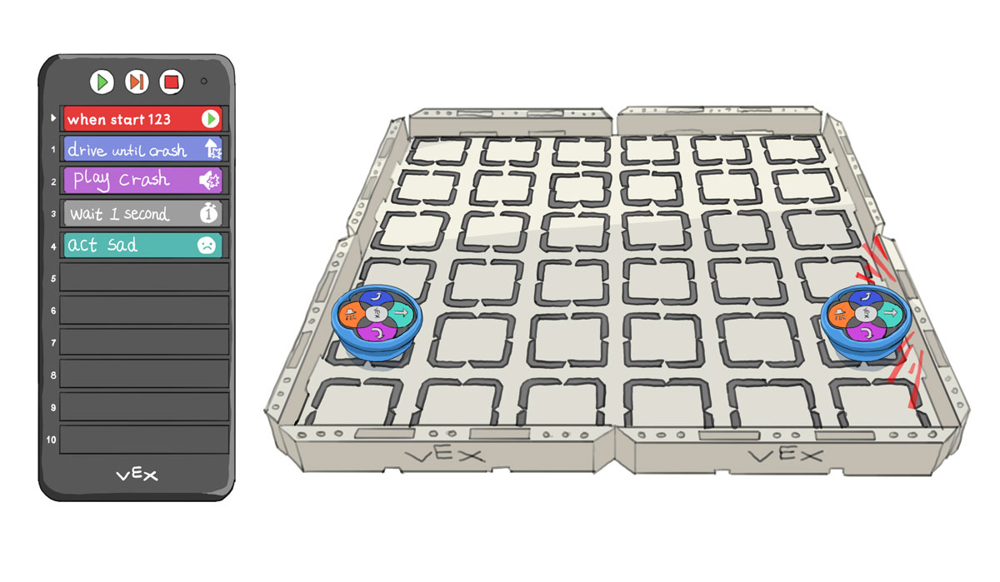
*Example program of the robot hitting a wall and making it dramatic.*

When they've had enough of experimenting on their own, give them this first challenge:

1. Place the robot on the bottom left tile of the field.
2. Ask your child to find different ways of getting to the top right tile. However, every time they make a turn, the robot must act happy, sad, or crazy afterwards.
3. If they suggest the simple **drive 4 > drive 1 > turn left > act sad > drive 4 > drive 1**, challenge them to use fewer cards to complete this challenge, as shown below.

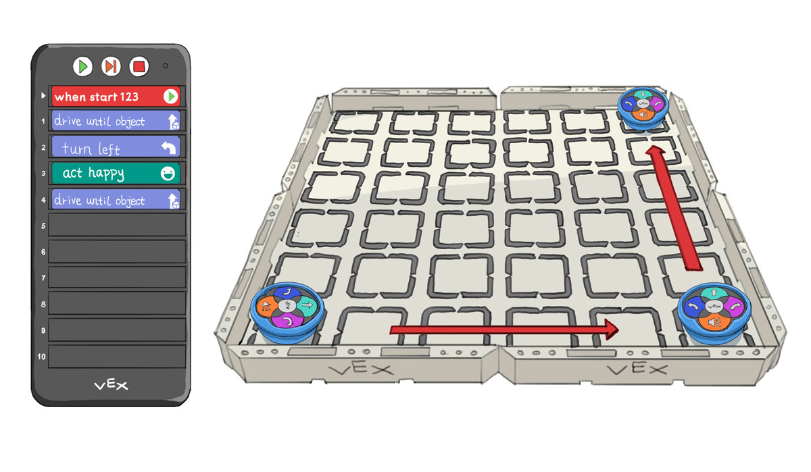
*The robot starts at the bottom left corner and reaches the top right corner using these commands.*

### Exercise 7: Getting emotional about obstacles

Building on previous experiences with obstacles, this exercise challenges your child to use the VEX Coder and its diverse cards to navigate around obstacles on the field. This time, your child will use the "drive until object" card to steer clear of obstacles and make the robot's journey more fun with sound (purple cards) and action (green cards).

1. Arrange multiple obstacles on the field to create a maze-like setup that the robot must navigate through to reach its destination.
2. Guide your child in planning a route around the obstacles, ensuring the "drive until object" card is used at least once for obstacle detection and navigation.
3. If there is still space on the Coder, encourage the addition of sound and/or action cards to the sequence whenever the robot encounters an obstacle that is not the edge of the VEX field itself.

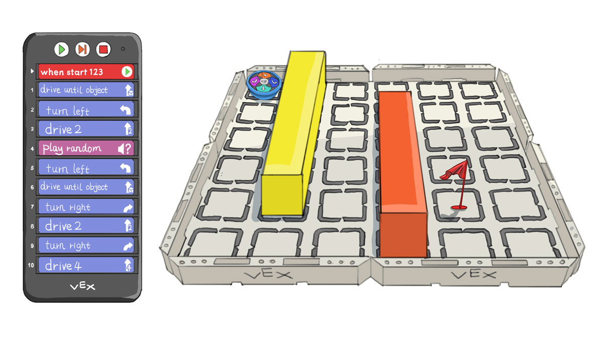
*The robot is ready to navigate a maze-like setup with obstacles on the field.*

## Introducing Conditional Logic: If Statements

Conditional logic, often represented by "if" statements, is a fundamental concept in programming that allows decisions to be made based on certain conditions. For example, consider your weekend plans: if it's sunny, you might go to the park; if it rains, you might stay home and watch a movie. In a similar way, think about choosing your outfit: if it's sunny, you wear shorts and a t-shirt; if it's raining, you put on warm clothes and take an umbrella. These everyday decisions are based on "if-then" logic, which is essential in coding too.

*We use the "if" condition in our day-to-day lives.*

In the context of the VEX 123 Coder, "if" cards enable your child to program the robot to react differently depending on what it senses in its environment. Each "if" card corresponds to a specific condition, such as detecting an object, identifying a color, or sensing a button press. When the robot encounters the specified condition, it will execute the command associated with that "if" card.

For more details on the Coder cards, check out [the VEX Coder Card Reference Guide](https://kb.vex.com/hc/en-us/articles/360055264691-VEX-Coder-Card-Reference-Guide).

### Exercise 8: If this, then that

In this exercise, we'll explore how "if" statements work. Think of an "if" statement as a decision point: if the condition is met (like detecting an object), the robot will do something. If not, it skips over that part and continues on.

Let's start simple. In the first example, we program the robot to move forward two tiles. If it sees an object in front of it, it will play a sound, like a doorbell.

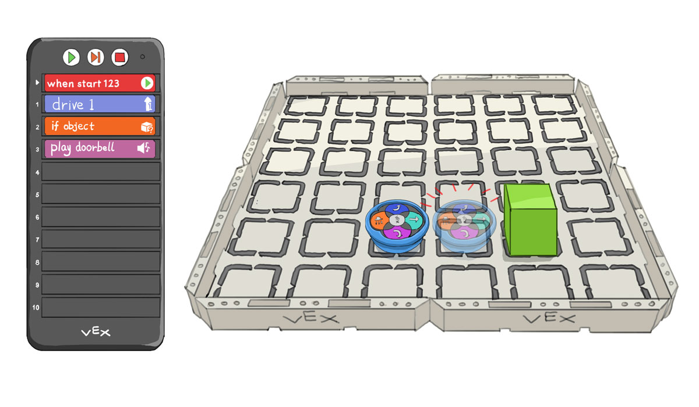
*The robot moves forward by one tile. If it sees an object, it plays a doorbell sound.*

You might think the robot only performs the action right after detecting an object, like playing a sound, but that's not the case. By adding more actions after the sound command, the robot will continue to perform each of them in sequence if it encounters an object.

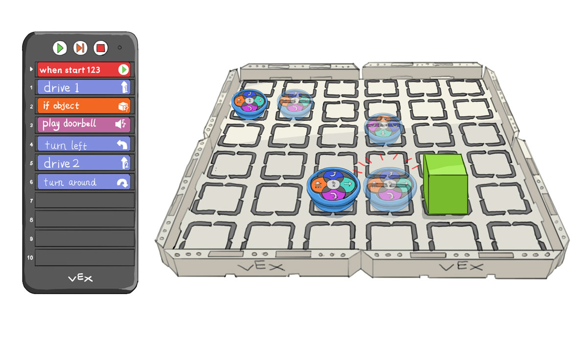
*After moving forward by one tile and finding an object, the robot rings the doorbell, turns and moves away.*

And what happens if the robot does not encounter an object in front of it? Well, it will skip the lines after the "if", in this case, **play doorbell > turn left > drive 2 > turn around**.

Now, what if you want the robot to execute something regardless of whether or not the "if" condition was satisfied. For example, at the end of it all, you want the robot to act happy, regardless of whether there it detected an object or not. To do so, we must incorporate the "end if" card. This card indicates to the Coder that the conditional sequence established by the "if" card has finished. Essentially, it closes off the conditional section. As a result, any actions placed after the "end if" card, such as "act happy", will be carried out irrespective of whether the initial "if" condition was met or not.

*The robot moves forward two tiles. If it finds an object, it rings the doorbell, turns, and moves away. Then, it acts happy, whether or not there was an object.*

You can run this code with and without an object in the robot's path to see the difference in behavior.

> **To Recap:** The reach of an "if" statement is up to you and can extend as needed. Until this point, we've contained the "if" block with an "end if" card. Moving forward, we'll discover other techniques to set the limits of the "if" section.

### Exercise 9: Color-coded decisions

We've seen how an "if" "code block" could be limited with the "end if" card. Another way to limit it is using another "if" condition.

In this exercise, we're going to program the robot to move forward and respond uniquely to different colored objects with the help of multiple "if" statements.

1. Start with moving the robot forward.
2. If the robot encounters a blue object, it will turn left.
3. If the robot encounters a red object, it will turn right.
4. And if it detects green, it will simply play a doorbell sound.

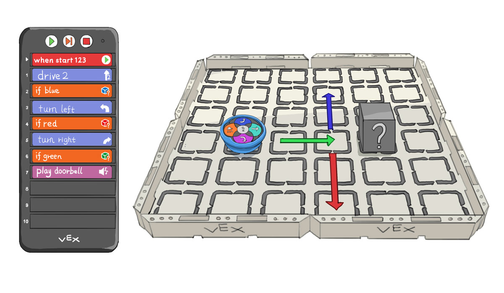
*The robot moves forward two tiles. Depending on the colored object that it encounters, it will perform different actions.*

> **To Recap:** So far, we've seen that we can "close off" an "if" section with either an "end if" or another "if" statement.

## Continuing Conditional Logic: Else Statement

Once your child understands the workings of the "if" condition, the next step is introducing the "else" statement, a fundamental part of conditional logic in programming. The orange "else" card provides an alternative path for the program to follow if the "if" condition isn't met. The "else" must always follow an "if". Think of it this way: "If the condition is met, do A; otherwise (else), do B".

### Exercise 10: To ring or not to ring

In this exercise, we'll set up a simple scenario to practice using the "if" and "else" concepts together. The task is to program the robot to move forward by one tile if no object is detected in its path. However, if there is an obstacle, the robot should play a doorbell sound instead.

*The robot moves forward if the path is clear or sounds a doorbell if an obstacle is detected.*

To ensure the robot acts happy after completing either the "if" or "else" actions, we use the "end if" card to close the conditional sequence. This signals to the Coder that both the "if" condition and the alternative "else" path have been addressed. Following the "end if" card with the "act happy" action guarantees this cheerful behavior is displayed, regardless of which path was taken in the sequence.

*The robot moves forward if the path is clear or sounds a doorbell if an obstacle is detected. Either way, the robot will act happy afterwards.*

Please note that the "end if" card plays a crucial role in defining the boundaries of your conditional statements. Without an "end if" to mark the conclusion of an "else" sequence, the Coder interprets all subsequent actions as part of the "else" condition, just like it would for an "if" condition.

> **To Recap:** We've covered the use of all the orange cards and how to conclude an "if" or "else" section. It's important to remember that an "else" should directly follow an "if" section, and an "end if" can be used to close out either an "if" or an "else" section.

## Exploring Loops

A loop is a fundamental programming concept that allows us to repeat certain sections of code multiple times without having to rewrite them. This is particularly useful in robotics, as it allows a robot to perform continuous actions without a lengthy code. With the VEX 123 Coder, the 'Go to start' card plays a crucial role in creating these loops. Once the programmed sequence reaches this card, it loops back to the beginning - just as the name suggests - enabling the robot to carry out its instructions indefinitely.

*Coder sequence with a 'go to start' card, illustrating how looping works through repeated code execution.*

### Exercise 11: Non-stop merry-go-round

In this exercise, we'll use the power of loops to create continuous, circular motion for our robot, much like a merry-go-round. But first, let's ease into the concept of a "linear" merry-go-round, which will continuously move back and forth between two obstacles in a straight line.

1. Begin by programming the robot to "drive until object".
2. Once it reaches the obstacle, have it "turn around" to face the opposite direction.
3. Add the "Go to start" card at the end of the sequence. The robot will now keep repeating this back-and-forth motion, just like a pendulum swinging between two points.

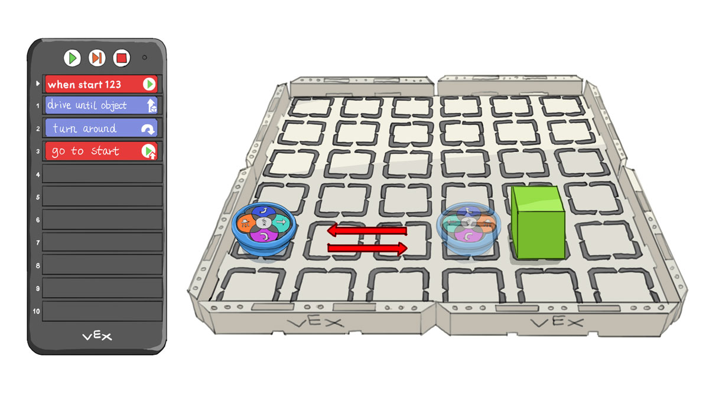
*Robot moving back and forth between two obstacles.*

Now, let's expand this concept to create a continuous circular path embodying the merry-go-round motion.

1. Start by programming the robot to move forward (by 1 or 2 squares).
2. Next, the robot should turn left. This pattern will make the robot trace one side of a square and be ready to trace the next side.
3. Keep the "Go to start" card at the end of this new sequence. As the robot follows this loop, it will continually move forward and turn, tracing a square path that mimics a circular, merry-go-round pattern.

Once you've seen enough, stop the loop by pressing on the red square button on the VEX Coder.

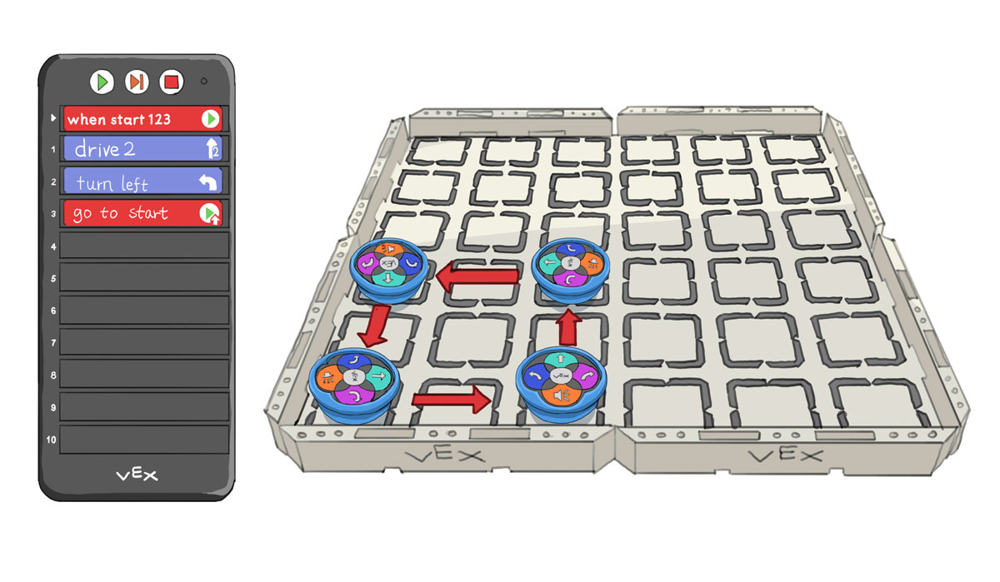
*The robot will drive forward, turn left, and repeat this forever, thus tracing a square path.*

### Exercise 12: The endless bump-a-thon

This exercise promises a lot of fun, and it's a chance for you, the parent, to actively guide your child through the programming. The aim is to program the robot to move straight until it bumps into an obstacle, react with a crash sound and some action (such as acting sad), and then make a random turn to continue and repeat its journey. Help your child think about how to use the "Go to start" card for the loop, and in case they have trouble, help them find the blue "turn random" card.

*One possible trajectory of the infinite loop of random movements.*

## Exiting Loops Programmatically

So far, we've been stopping loops manually by pressing the red square button on the Coder. Such loops are known in programming as "infinite loops" because they can continue indefinitely if not interrupted. To stop a loop through programming, we introduce a new tool: the "stop" card. When the program reaches the "stop" card, it completely stops the program, much like when you press the red square button on the Coder. Try recreating Exercise 13 to see the "stop" card in action.

### Exercise 13: Stop right there

Let's see the "stop" card in action. We've set up a sequence where the robot moves forward and uses its sensors to look for objects. If it finds something in its way, it gives a signal by playing the doorbell sound. Right after the signal, the "stop" card comes into play, telling the robot to halt everything it's doing, and exit the program. This mimics the same effect as manually pressing the red square button on the Coder, but it's all handled through programming.

*The robot moves one step at a time, until it encounters an object, at which point it rings the doorbell and stops the code.*

## Combining What We've Learned

All the hard learning is done now! Your child has navigated through basic commands, tackled logical "if" and "else" statements, and harnessed the power of loops. They've now got a solid foundation to blend these elements in increasingly sophisticated ways. Let's put all these skills to the test in our final exercise!

### Exercise 14: Predicting code

This final exercise is a practical test to see if your child can predict the flow of a piece of code sequence. It's designed to be a relatively challenging puzzle, but if your child can crack it, they've mastered the concepts we've explored.

1. Arrange your field to match the layout shown in the illustration.
2. Insert the cards into the Coder as displayed.
3. Have your child explain how they think the robot will move, asking them which card the Coder will read next and why.
4. Activate the program and watch the robot in action. Use the orange Step button together to track each step and confirm the sequence's flow.

*Sequence checking for all 3 colors, and having the robot act different depending on the color in front.*

If your child can read and comprehend the program, they are showing a readiness to progress in their coding journey, fully equipped to tackle the next challenges that await.

## Diving into VEXcode 123

After mastering the basics of VEX 123 with hands-on coding, it's time to explore VEXcode 123, an easy-to-use, drag-and-drop online platform. This tool allows your child to expand their coding capabilities by connecting the VEX 123 robot to a computer via Bluetooth. They can now create and run more complex programs that go beyond the ten-card limit of the physical Coder. VEXcode 123 provides a user-friendly interface that enhances their programming experience, giving your child the tools to build on the coding fundamentals they've already developed.

### Connecting your robot with bluetooth

Open VEXcode 123 on your browser (by visiting https://code123.vex.com/) and check that your computer's Bluetooth is on. Then, simply click on the 'Connect' button, which will prompt you to select your robot from the list of available devices. Ensuring your robot is on and nearby will facilitate an easy connection.

*Click on 'ROBOT', then 'Connect' to start setting up the connection.*

### Navigating the VEXcode 123 interface

The VEXcode 123 platform is designed with intuitive drag-and-drop coding blocks, mirroring the physical VEX Coder Cards' simplicity. Recognize the 'Start,' 'Step,' and 'Stop' buttons in the top right corner. Try dragging and dropping some blocks from the left-hand side onto the canvas. It's mostly all the same as the Coder.

Here is an example program which your child should easily be able to understand now that they've played with the Coder cards:

*Notice how you can adjust the number of steps and the degrees of rotation directly in the blocks. You can even switch from "steps" to "mm" by clicking on the default setting.*

> Manually stop the execution of the code by pressing the 'Stop' button.

And here's another example that builds on what they've learned. If there's any confusion, remind them about the "Go to start" card which reinitiates the sequence:

1. Navigate to the yellowish-orange "Control" section and drag the "repeat 10" block.
2. Modify it to repeat 3 times.
3. Add the "glow green" block into this loop, and observe how it automatically carries any blocks placed beneath it into the loop.
4. Place the "act sad" block (together with "play sound") below the loop so these actions occur only once the loop completes.

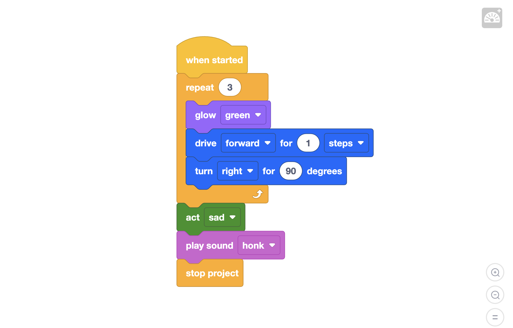
*This setup repeats three times before concluding with a drama show and a honk.*

Finally, let's go over the **if** statement.

1. From the "Control" section, drag the "if <> then" block.
2. Place it after the "drive forward" block.
3. Insert "act sad" (including "play sound") below the "if" block.

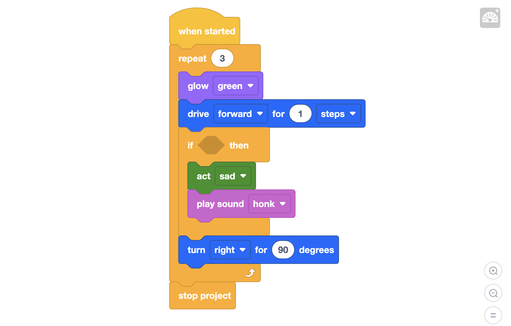
*Here's an incomplete 'if' statement, awaiting a condition.*

The empty space in the 'if' block is designed to fit a condition. This space has a distinctive elongated hexagonal shape. In the cyan-colored "Sensing" section, you’ll find blocks with this same shape. These are designed to fit as conditions in the 'if' statement.

*A complete 'if' sequence where the robot checks for an object before proceeding.*

Encourage your child to create programs longer than 10 blocks and explore functionalities beyond what was possible with the Coder. Spend some time in sections like Drivetrain, Sound, Actions, Control, and Sensing. Not every block will be familiar yet, so stick to experimenting with the blocks they understand.

## Nested if

After your child has had a chance to experiment and create their own code, it's a good opportunity to delve into the concept of nested "if" statements together. Nested "if" statements are like a set of choices within choices. Imagine your child deciding what to play with: if it's sunny, they might go outside. But if they find their bike's tire is flat, they decide to play soccer instead. Each "if" leads to another "if", like a branching path where each step depends on the outcome of the previous one. This is how we can make a program, or our robot in this case, make a series of decisions that depend on different conditions.

Discuss with your child each step the robot takes, asking questions like "What will the robot do if it sees an object?" and "What happens if there's an obstacle on the left too?" This will help them grasp how nested "if" statements influence the robot's behavior.

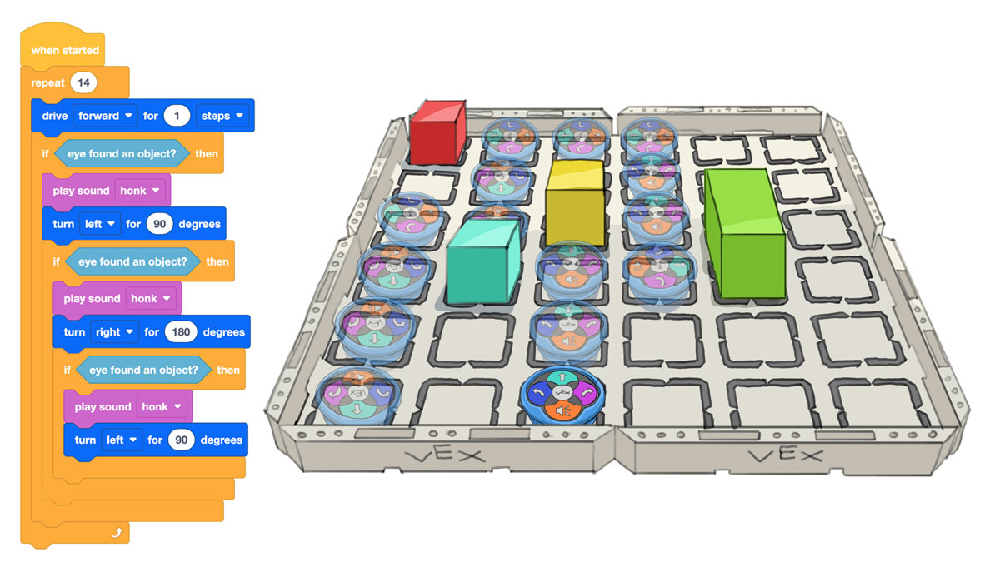
*The robot's journey is a decision-making adventure: it moves forward until it meets an obstacle, then checks left: if it's clear, it turns left; if not, it turns right.*

## Introducing variables

In programming, variables act like labeled boxes that store information. Just as you might use a box labeled "holiday decorations" to store specific items, variables in coding keep track of data that your program needs to remember.

Let's create a variable in the VEXcode 123 platform:

1. Navigate to the orange "Variables" section on the interface.
2. Click on "Make a Variable".
3. Name your variable `numberOfTurnsCompleted`.

You now have a variable, or a "box", labeled `numberOfTurnsCompleted`, but it's empty at the moment. You can visualize it by dragging and dropping the variable onto the canvas, outside your main program.

To assign a value to this variable, use the block "set `numberOfTurnsCompleted` to 0". This action places the number 0 inside your `numberOfTurnsCompleted` variable.

[same illustrations of box with a label `numberOfTurnsCompleted` with number 0 inside]

Variables are named to reflect meaningful elements in your code or real-world values, and they are especially useful for tracking changes over time. For example, a variable might represent the number of laps a runner completes, the score in a game, or even the temperature on a thermostat. In the case of our robot, the variable `numberOfTurnsCompleted` keeps count of each turn the robot makes, updating from 0 to 1, 2, 3, and so on, similar to adding items to a box or updating a tally.

[illustration of same box with 0 leaving, and 1 coming in]

For now, this variable might not seem like it’s doing much, but soon we'll use it to make our robot behave differently based on how many turns it has completed. This ability to dynamically change the information stored in a variable is what makes them so powerful in programming.

## Introducing the while loop

In programming, loops let us repeat actions easily. We've already used the "repeat" block for looping a set number of times. Now, let's look at the "while loop", which is common in many programming languages.

Think of a "while loop" as a way to keep doing something as long as a certain condition remains true. For example, imagine your brother has a big test coming up, and he concentrates best with classical music playing in the background. You decide to help by setting a rule: "While my brother is studying, I will play the piano." In programming terms, this would look something like:

[illustration of VEX online coder blocks, showing code for : while brother is studying, place one piece on the piano]

Here, "brother is studying" serves as the condition, and "play one classical piece on the piano" is the action you perform. After each song, you check again to see if your brother is still studying. If he stops, the condition "brother is studying" becomes false, and you stop playing, thus exiting the loop.

In VEXcode 123, the condition for a "while loop" fits into the diamond-shaped slot in the block, similar to how conditions are used in "if" statements. You insert a condition that the computer evaluates before each iteration of the loop. If the condition evaluates as true, the loop continues; if it turns out to be false, the loop ends.

### Drawing a square with a "while loop"

Let's apply this to our VEX 123 robot. To draw a square, the robot must move forward and turn, repeating this process four times. The "while loop" is perfect for this.

However, we need a way to tell the robot when to stop looping. This is where comparison operators and variables come into play. Comparison operators let us compare two values:

- < (less than)
- \> (greater than)
- == (equal to)
- != (not equal to)
- <= (less than or equal to)
- \>= (greater than or equal to)

For example, `3 > 5` is a false statement, while `10 >= 10` is true.

We can also use variables here. Say we have a variable named `counter`, and `counter` is set to `14`, i.e. we place the number 14 in a box labeled "counter". The statement `counter > 21`, which simplifies down to `14 > 21`, is false, while `counter > 0`, which simplifies to `14 > 0`, is true.

For example, we can have a condition as follows:

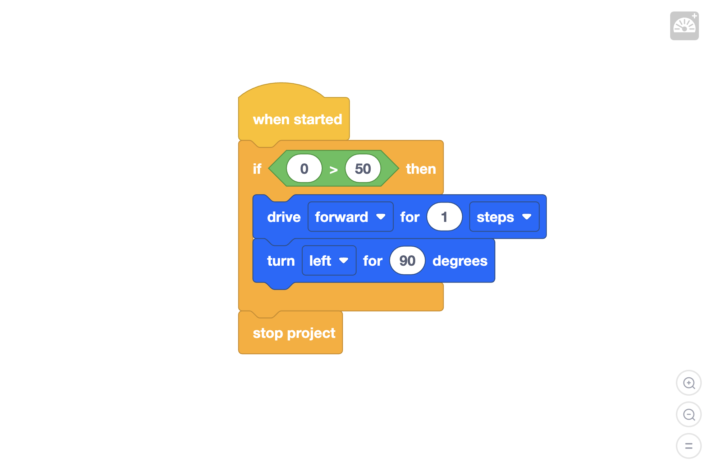
*Since the statement "0 > 50" is false, the program will not enter the if statement, and the robot will not do anything.*

It's a very similar story with the while loop. But this time, let's create a variable instead of directly comparing two numbers.

1. We create a variable named `counter` and initially set it to 0; think of it as our starting point.
2. Our "while loop" will use a comparison operator to check: "While counter is less than 4", we'll ask the robot to move and turn.

*Since the statement "counter < 4" is true, the program will enter the while loop, and the robot will move forward by 1 step, non-stop.*

This is known as an infinite while loop. The variable `counter` is set to 0 initially, and the program checks "Is `counter` less than 4?". Since it is, the program enters the while loop. When the program reaches the last line of the loop, it comes back to the top, and asks again: "Is `counter` less than 4?". So on and so forth indefinitely.

The solution is to increment `counter` after each iteration of the loop. After each turn, we increment counter by one. Each increment gets us closer to our stopping point, the completion of the square. We'll increase counter by one each time through the loop; this is known as incrementing.

Ultimately, "incrementing" a value requires us to "change" the value, and that is exactly the block that we will need to drag on the VEXcode 123 platform.

*We use the "change" block in order to add 1 to the counter each time the loop is entered.*

This process ensures that once counter reaches 4, the condition counter < 4 becomes false, effectively stopping the loop after the robot completes the square. Each increment moves us one step closer to ending the loop, preventing it from becoming infinite and allowing the robot to finish drawing the square precisely four times.

Here is the detailed explanation explaining how the counter controls the loop, ensuring the robot performs the exact number of moves and turns needed to draw a square and then stops.

1. **Initialize the Counter:** Before entering the loop, we set the `counter` variable to 0. This is our starting point for counting the number of turns the robot makes.
2. **Check the Condition:** At the beginning of each loop iteration, the program checks the condition `counter < 4`. Since `counter` is initially 0, which is less than 4, the condition is true.
3. **Execute the Actions:** With the condition being true, the robot proceeds to perform the programmed actions within the loop. In this case, it moves forward and then turns.
4. **Increment the Counter:** After executing the actions, `counter` is incremented by 1. This incrementing step is crucial as it updates the number of turns the robot has completed. After the first turn, `counter` becomes 1.
5. **Repeat the Check and Actions:** The loop now returns to step 2. The program re-evaluates the condition with the updated counter value. Since 1 is still less than 4, the loop continues, allowing the robot to perform the next move and turn.
6. **Further Increments and Checks:** This cycle of checking the condition, executing actions, and incrementing the `counter` repeats. With each iteration, `counter` increases (2, then 3).
7. **Condition Becomes False:** Once the robot completes the fourth turn, the counter is incremented to 4. At this point, when the loop checks the condition `counter < 4` again, the result is false because 4 is not less than 4.
8. **Exit the Loop:** Because the condition is now false, the loop stops executing. The robot has successfully completed the square, making four turns as intended.

Please note that it is also possible to increment the counter in the following manner:

*We can also use the "set counter" block in order to add 1 to the previous counter value each time the loop is entered.*

### Beyond simple repetition: logical operators

So far, we've explored comparison operators that help determine whether a condition is met, such as whether a `counter` is less than 4. These operators are fundamental for making decisions in loops and if statements.

To enhance the capabilities of our loops, we can also utilize logical operators like `not`, `and`, and `or`. These operators allow us to combine multiple conditions, creating more nuanced decision pathways for our programs. For example, a loop could continue as long as the `counter` is less than 4 AND no object is detected ahead, making the robot's actions more sensitive to its surroundings.

Here's how you might incorporate logical operators into your loops:

- **"While NOT (object found)"**: This loop will keep the robot moving forward until it detects an object. The use of `not` here negates the condition, meaning the loop runs as long as the condition (object found) is false.
- **"While (object found) OR (counter is less than 4)"**: This condition provides two scenarios where the loop can continue. It combines the presence of an object with the counter’s value, making the loop more versatile. The loop continues if either condition is met — either an object is found or the counter hasn’t reached 4.

Logical operators allow us to create more complex and interactive programs, enhancing the robot's decision-making abilities. It's a bit like setting rules for a game where multiple conditions can change the outcome of each turn.

Incorporating these into a "while" loop not only mimics more advanced coding practices but also enriches the programming experience by allowing for complex, condition-driven behaviors in our robotic projects.

### Combining loops with if statements

## Final Thoughts

In this guide, your child started with basic commands using the touch buttons on the VEX 123 robot and progressed to more complex programming with the Coder cards. They've tackled "if-else" statements, discovered the power of loops, and learned how to combine different commands to control the robot's actions effectively. For more ideas and activities to extend their learning journey with the VEX 123, visit [VEX 123 Activities](https://education.vex.com/stemlabs/123/activities).

As they grow and look for new challenges, the VEX Go kit serves as an ideal next step. Aimed at children aged 8-9, VEX Go builds on the foundational skills from VEX 123, offering more advanced projects and deeper programming concepts.

This exploration of robotics and coding opens up a world of creativity and problem-solving. With each step, your child is laying the groundwork for a strong understanding of STEM, ready to dive into more complex and rewarding projects.
