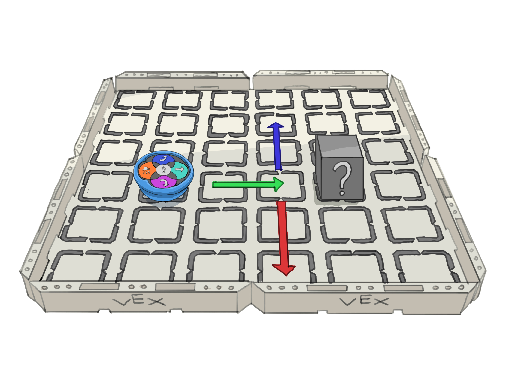
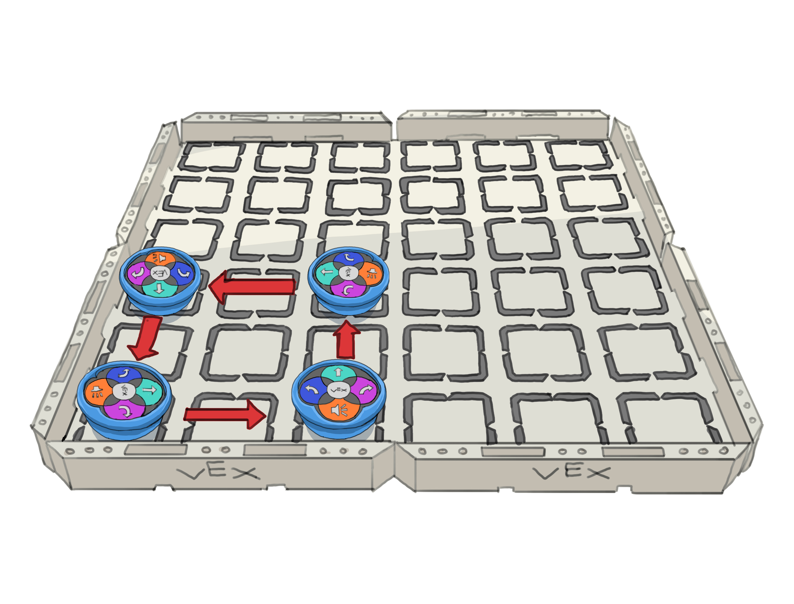

Welcome to the playful world of VEX 123! This is where your child can take their first steps into coding and robotics, all while having a ton of fun. As a parent, you might wonder how you can help your little one get the most out of the VEX 123 Robot. Don't worry; this guide is here to walk you through just that. It offers a comprehensive walkthrough from setting up your VEX 123 Robot and programming with its touch buttons, to advancing with VEX Coder Cards, accompanied by a series of progressively challenging exercises that introduce key programming concepts like conditional logic and loops.

## Table of Contents

[Introduction to VEX 123](#introduction-to-vex-123)

[Getting Started with Your VEX 123 Robot](#getting-started-with-your-vex-123-robot)

[Programming Basics with Touch Buttons](#programming-basics-with-touch-buttons)

- [Exercise 1: First steps](#exercise-1-first-steps)
- [Exercise 2: Sequence of moves](#exercise-2-sequence-of-moves)
- [Exercise 3: Predicting the movement](#exercise-3-predicting-the-movement)

[Coding with the VEX 123 Coder](#coding-with-the-vex-123-coder)

- [Exercise 4: Avoiding obstacles](#exercise-4-avoiding-obstacles)
- [Exercise 5: Basic movements with cards](#exercise-5-basic-movements-with-cards)
- [Exercise 6: Combining different cards](#exercise-6-combining-different-cards)
- [Exercise 7: Getting mad about obstacles](#exercise-7-getting-mad-about-obstacles)

[Introducing Conditional Logic: If Statements](#introducing-conditional-logic-if-statements)

- [Exercise 8: If this then that](#exercise-8-if-this-then-that)
- [Exercise 9: The more ifs the better](#exercise-9-the-more-ifs-the-better)

[Continuing Conditional Logic: Else Statement](#continuing-conditional-logic-else-statement)

- [Exercise 10: To Ring or Not to Ring](#exercise-10-to-ring-or-not-to-ring)

[Exploring Loops](#exploring-loops)

- [Exercise 11: Non-Stop Merry-Go-Round](#exercise-11-non-stop-merry-go-round)
- [Exercise 12: The Endless Bump-a-thon](#exercise-12-the-endless-bump-a-thon)

[Combining What We've Learned](#combining-what-weve-learned)

- [Exercise 13: Checking for color](#exercise-13-checking-for-color)
- Exercise 14: If/else + loop combination

[Final Thoughts](#final-thoughts)

## Introduction to VEX 123

Vex 123 is an interactive robotics kit designed to introduce the youngest learners, starting as early as 4 years old, to the foundational concepts of coding and robotics. As the most elementary offering in the Vex Robotics lineup, it's tailor-made for early childhood education, emphasizing hands-on play and exploration to spark interest in STEM (Science, Technology, Engineering, and Mathematics) fields from a preschool age. Plus, it offers a screen-free learning experience, making it an ideal way to engage with technology hands-on.

## Getting Started with Your VEX 123 Robot

In this guide, I will assume that you have the [VEX 123 Kit](https://www.vexrobotics.com/123-kits.html), which includes the 123 Robot, the Coder Bundle, as well as the 123 field.

*The VEX 123 complete kit.*

First, ensure your Vex 123 Robot is fully charged:

- Connect a USB-C cable to the robot's charging port and the other end to a power source.
- A flashing red light on the robot's Start button indicates it's charging.
- Once the flashing turns green, the robot is fully charged.

*Charging the robot.*

Once fully charged, you can turn on the robot by pushing its wheels along a flat surface.

*Waking the robot up.*

## Programming Basics with Touch Buttons

Programming with the VEX 123 Robot's touch buttons is a straightforward way to teach your child the basics of coding. Use the buttons on the top of the robot to input a sequence of commands. Pressing the central green Vex button will set the robot in motion, executing the commands in the order they were entered. Each button on the robot triggers a specific action:

- Move Forward: Directs the robot to move forward by one tile.
- Left/Right: Rotates the robot 90 degrees to the left or right.
- Sound: Triggers the robot to play a sound.
- VEX (Start): Executes the programmed sequence of commands. Also used to turn off the robot by holding this button for 3 seconds.

### Exercise 1: First steps

Let's start by just playing around.

Place the robot on the 123 field, on the middle of a tile, pointing at one of the four directions, as shown in the illustration below.

*The robot should point in one of these 4 directions.*

Then have your child press the "move forward" button, followed by the central "VEX" button to start.

Once they observe the robot advancing by one tile, return the robot to its starting point and press the left button. When you then press the center VEX button (this action is referred to as "running the program"), you'll notice that the robot still remembers the initial "move forward" command and simply adds the new "turn left" command to its sequence. Continue to introduce one command at a time, pressing the center VEX button each time to run the program and observe the outcome. It's important for your child to grasp that the robot retains previously input commands and combines any new commands with those already in memory.

To clear the robot's memory of the existing command sequence, simply have your child pick up the robot and give it a shake. This action 'resets' the robot, erasing all previous commands as if shaking them out of its 'brain.' Give it a try and see how the robot responds as if it's learning for the first time!

*Making the robot forget the previous commands.*

### Exercise 2: Sequence of moves

Now that you're familiar with the robot's basic movements, let's focus on a 3x3 tile grid, which is one quarter of the entire VEX 123 field. Place the robot on the bottom left tile to start.

*Robot placed at the bottom left tile.*

The goal is to program the robot to reach the top right tile, exploring different sequences of commands to navigate across the grid.

- Have your child plan a path and then input the sequence using the forward and turn buttons to navigate the robot across the grid.
- If you child succeeds in finding a path, challenge them to find other paths by experimenting with combinations of moves and turns.
- After each try, remember to shake the robot to clear its memory and prepare it for a new set of commands.

*Robot moving from one side of the field to the other with one possible set of commands that instruct it to get there.*

### Exercise 3: Predicting the movement

This exercise shifts focus to prediction and critical thinking. Using the VEX 123 field, your child will now predict the robot's final position after a series of commands.

1. Position the robot at the bottom left tile, ensuring your child is watching.
2. Clearly press a sequence of commands in view of your child, such as "forward, forward, turn left, forward".
3. Before having the robot play out the commands, ask your child to predict where on the field the robot will end up after executing these commands. Have them point to the tile.
4. Press the "VEX" button to set the robot in motion and observe whether the robot's final position matches your child's prediction.
5. If they get it right, increase the complexity and/or the number of commands given to the robot.
6. For an occasional added twist, without resetting the robot's memory, add an additional command like "forward" to the existing sequence. Now, your child must also pay attention to whether you shake the robot!

As a simple example, here are some ideas of sequences (note that "turn left" and "turn right" are abbreviated with just "left" and "right"):

- forward, forward, forward
- shake
- forward, forward, left, forward
- shake
- left, left, right
- shake
- forward, left, right, forward
- forward
- shake
- forward, forward, left, left, forward, right, forward

*A child predicting where the robot will terminate its sequence.*

Through this exercise, your child will enhance their ability to predict outcomes based on a sequence of actions, a fundamental skill in programming logic and computational thinking.

### Exercise 4: Avoiding obstacles

Start by placing a single obstacle between the robot's starting point and its destination on the field, as shown in the first illustration below. Encourage your child to program the robot to navigate from the start to the finish, carefully avoiding the obstacle. The obstacle can be anything that fits within the space of one or more tiles, such as a smartphone, sunglasses, or an empty cup.

*Programming the robot to navigate around a single obstacle on the field.*

To increase the challenge, consider adding multiple obstacles to the field. This will require more complex programming and strategic planning to successfully guide the robot to its destination. Use a variety of objects as obstacles to make the exercise more engaging and dynamic.

*Introducing multiple obstacles for enhanced navigation and problem-solving.*

## Coding with the VEX 123 Coder

The VEX 123 Coder and its Coder Cards transition from the robot's touch buttons to a visually intuitive format for programming. The cards remove the need to remember button sequences by clearly showing each command, making it simpler to control the robot and create complex sequences. With the Coder, children can move beyond basic commands to explore more advanced programming concepts such as control flow.

Once batteries are inserted in the VEX Coder, you can turn it on by pressing the Start button. To connect the Coder to the robot, press and hold the Start and Stop buttons on the Coder and the Left and Right buttons on the Robot for 5 seconds until the yellow lights appear, signaling the start of the pairing process. You only need to pair them once, and they will stay connected for subsequent uses.

For more details about the Coder, visit [Using the VEX Coder](https://kb.vex.com/hc/en-us/articles/360055037612-Using-the-VEX-Coder).

### Exercise 5: Basic movements with cards

In this exercise, you'll use the **blue movement cards** to direct the robot across the field. Start by selecting a series of movement cards that will guide the robot in a simple path, such as a straight line using the "drive 1" cards.

> Please note that the first card must always be the red "when start 123" card.

*Sequence illustrating a straight-line path using movement cards.*

Next, try adding some rotations: "turn left", "turn right", "turn around" and "turn random". Allow them at least a few minutes to play around the with current set of cards, and to try out longer and longer sequences.

And finally, try out the "drive until crash", "drive until object", and "drive until line" cards. See what they do. Programming is all about experimenting!

*Sequence example for returning the robot to the bottom left starting point.*

This is also a great time to practice stepping through your code. Instead of pressing on the green Start button, click on the orange Step button to guide you through the code, step by step, one command at a time. To go through the steps, press the Step button to move forward in the code, as will be indicated by the orangish-yellow light on the side of the command to be run next.

For an in depth guide about stepping, visit [Stepping Through a Project with the Coder](https://kb.vex.com/hc/en-us/articles/360056924531-Stepping-Through-a-Project-with-the-Coder).

### Exercise 6: Combining different cards

Now, let's add more variety to your robot's movements by incorporating other types of cards into your sequences. This introduces the concept of combining movements with actions (the green cards), sounds and looks (the two shades of purple), and breaks (the grey cards), adding a layer of complexity and fun to your coding projects.

To explore the full range of Coder cards, excluding the orange and red cards for now, visit the [VEX Coder Card Reference Guide](https://kb.vex.com/hc/en-us/articles/360055264691-VEX-Coder-Card-Reference-Guide).

Have your child play around with all these cards, in whatever order they wish. Make sure they write some programs using all types of cards. This could them anywhere from a couple of minutes, to hours of fun.

*Example program of the robot hitting a wall and making it dramatic.*

When they've had enough with experimenting on their own, give them this first challenge: place the robot on the top right tile of the field, and have your child find different ways of getting to the bottom left tile. There is a twist however: every time they turn left or right, they have to play an action card ("act happy", "act sad", or "act crazy"). At first they will suggest the simple drive 4 > drive 1 > turn left > act sad > drive 4 > drive 1.

Once they do that, challenge them to use less cards to complete this.

*The robot starts at the top right corner, pointing left, and reaches the bottom left corner using these commands.*

### Exercise 7: Getting mad about obstacles

Building on previous experiences with obstacles, this exercise challenges your child to use the VEX Coder and its diverse cards to navigate around obstacles placed on the field. This time, your child will use the "drive until object" card to steer clear of obstacles and make the robot's journey more fun with sound (purple cards) and action (green cards).

1. Arrange multiple obstacles on the field to create a maze-like setup that the robot must navigate through to reach its destination.
2. Guide your child in planning a route around the obstacles, ensuring the "drive until object" card is used at least once for obstacle detection and navigation.
3. If there is still space on the Coder, encourage the addition of sound and action cards to the sequence, turning the task into a lively and engaging journey for the robot.

*The robot ready to navigate a maze-like setup with obstacles on the field.*

*Code sequence guiding the robot to navigate around obstacles and reach its destination.*

## Introducing Conditional Logic: If Statements

Conditional logic, often represented by "if" statements, is a fundamental concept in programming that allows decisions to be made based on certain conditions. In the context of the VEX 123 Coder, "if" cards enable your child to program the robot to react differently depending on what it senses in its environment.

Each "if" card corresponds to a specific condition, such as detecting an object, identifying a color, or sensing a button press. When the robot encounters the specified condition, it will execute the command associated with that "if" card.

For more details on the Coder cards, [check out this link](https://kb.vex.com/hc/en-us/articles/360055264691-VEX-Coder-Card-Reference-Guide).

### Exercise 8: If this then that

In this exercise, we'll explore how "if" statements work with the VEX 123 Coder. Think of an "if" statement like a decision point: if the condition is true (like detecting an object), the robot will do something special. If not, it skips over that part and continues on.

Let's start simple. In the first example, we program the robot to move forward two tiles. If it sees an object in front of it, it will play a sound, like a doorbell.

*The robot moves forward two tiles. If it finds an object, it plays a doorbell sound.*

You might think the robot only carries out the action right after detecting an object, like playing a sound, but that's not the case. By adding more actions after the sound command, the robot will continue to perform each of them in sequence if it encounters an object.

*After moving forward two tiles and finding an object, the robot rings the doorbell, turns around, and moves away.*

To have the robot express an emotion such as acting sad regardless of the outcome of the "if" condition, we incorporate the "end if" card. This card indicates to the Coder that the conditional sequence established by the "if" card has finished. As a result, any actions placed after the "end if" card, like "act sad," will be executed irrespective of whether the initial "if" condition was met or not.

*The robot moves forward two tiles. If it finds an object, it rings the doorbell, turns, and moves away. Then, it acts happy, whether or not there was an object.*

Try running this code with and without an object in the robot's path to see the difference in behavior.

### Exercise 9: The more ifs the better

In this exercise, we'll create a scenario where the robot moves forward and reacts differently to colored objects it encounters. The robot will turn left if it detects a blue object, turn right for red, and play a doorbell sound if it sees green.

*The robot moves forward two tiles. If it finds an object, it rings the doorbell, turns, and moves away. Then, it acts happy, whether or not there was an object.*

Here is the corresponding code for this program.

*The robot moves forward two tiles. If it finds an object, it rings the doorbell, turns, and moves away. Then, it acts happy, whether or not there was an object.*

### Continuing Conditional Logic: Else Statement

After mastering the "if" statement, the next step is to introduce the "else" concept, a fundamental part of conditional logic in programming. The "else" statement provides an alternative path for the program to follow if the "if" condition isn't met. In other words, it tells the robot, "If the condition isn't true, then do something else instead."

### Exercise 10: To Ring or Not to Ring

In this exercise, we'll set up a simple scenario to practice using the "if" and "else" concepts together. The task is to program the robot to move forward by one tile if no object is detected in its path. However, if there is an obstacle, the robot should play a doorbell sound instead.

*The robot moves forward if the path is clear, or sounds a doorbell if an obstacle is detected.*

To ensure the robot acts happy after completing either the "if" or "else" actions, we use the "end if" card to close the conditional sequence. This signals to the Coder that both the "if" condition and the alternative "else" path have been addressed. Following the "end if" card with the "act happy" action guarantees that this cheerful behavior is displayed, no matter which path was taken in the sequence.

*The robot moves forward if the path is clear, or sounds a doorbell if an obstacle is detected. Either way, the robot will act happy afterwards.*

Please note that the "end if" card plays a crucial role in defining the boundaries of your conditional statements. Without an "end if" to mark the conclusion of an "else" sequence, the Coder interprets all subsequent actions as part of the "else" condition.

## Exploring Loops

Loops are a fundamental concept in programming that allow certain sections of code to be repeated multiple times. This repetition can simplify complex tasks into manageable, repetitive actions. In the context of the VEX 123 Coder, the "Go to start" card is instrumental in creating loops. When the sequence reaches this card, it circles back to the beginning, allowing the robot to repeat its actions indefinitely or until a specific condition is met.

### Exercise 11: Non-Stop Merry-Go-Round

This exercise introduces the concept of looping by creating a simple, circular pattern that the robot will endlessly follow, much like a merry-go-round.

- Start by programming the robot with a straightforward sequence: move forward and then turn left. This pattern will make the robot trace a square path.
- Insert the "Go to start" card at the end of this sequence to initiate the loop, causing the robot to continuously navigate in a square, mimicking a merry-go-round motion.

*The robot will drive forward, turn left, and repeat this forever.*

*The robot moves forward if the path is clear, or sounds a doorbell if an obstacle is detected. Either way, the robot will act happy afterwards.*

### Exercise 12: The Endless Bump-a-thon

In this exercise, we're going to transform a previous activity into an endless loop of discovery using the "go to start" card. The robot will continuously drive forward until it crashes into a wall, at which point it will emit a crash sound and display a sad action. Afterward, it will randomly turn and repeat the process, creating a never-ending cycle of bump-and-turn adventures. To stop this infinite loop, simply press the red square button on the VEX Coder.

*One possible trajectory of the robots random movements.*

*Infinite loop code using the "turn random" card.*

## Combining What We've Learned

[ talk about how to stop a loop. For example, stop the loop once an object is encountered. use the "stop" card. stop will stop the entire program, including exiting the loop]

### Exercise 13: Checking for color

Now we will try working with multiple "if" cards.

1. Place colored objects (red, green, blue) at different points on the field.
2. Guide your child to create a sequence using "if color detected" cards for each color, assigning specific actions for each one, such as turning or making a sound, and ending each sequence with an "end if" card.
3. Watch how the robot identifies each color and performs the corresponding actions, showcasing its ability to make decisions based on color.

*Sequence checking for all 3 colors, and having the robot act different depending on the color in front.*

*The robot moves left, right, or stops, depending on what color is in front.*

## Final Thoughts

For more ideas, visit [VEX 123 Activities](https://education.vex.com/stemlabs/123/activities)
